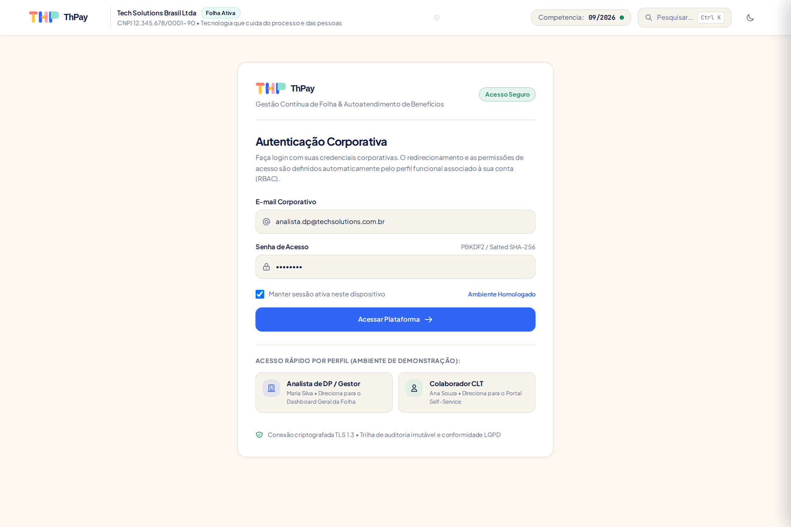
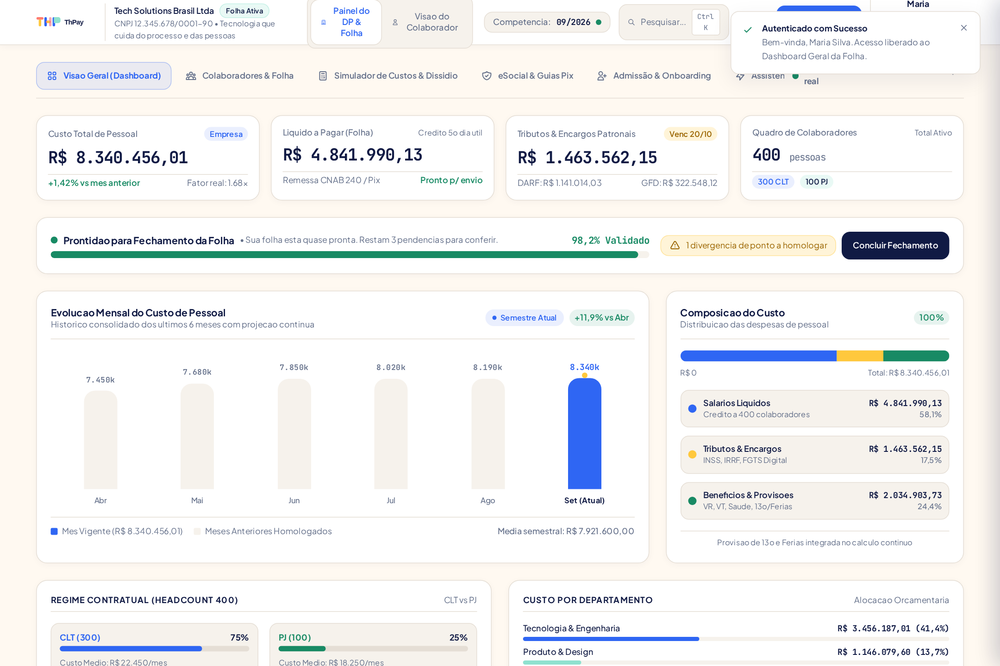
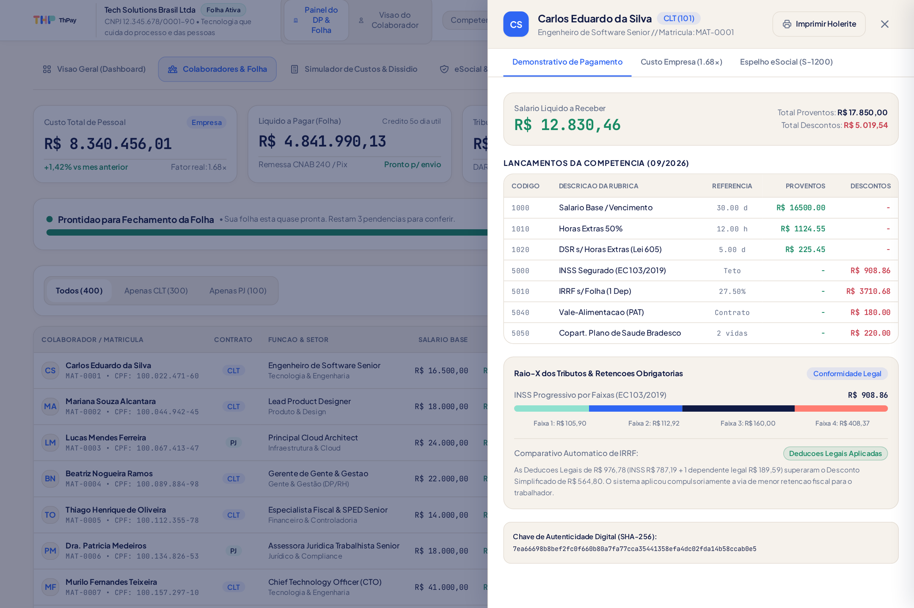
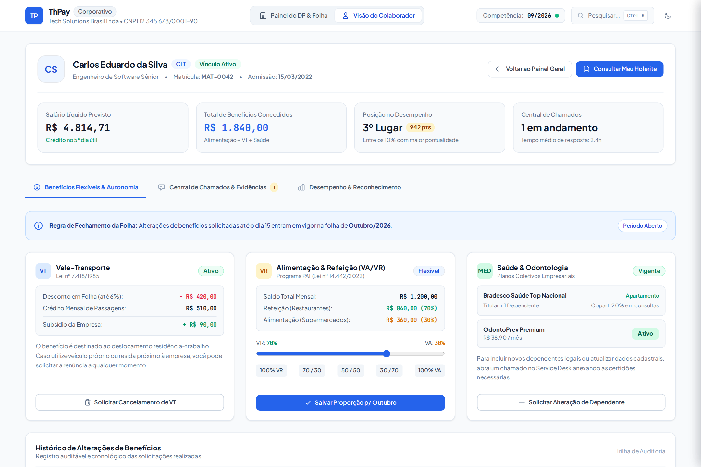
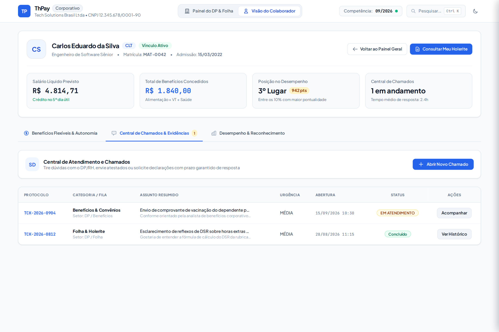
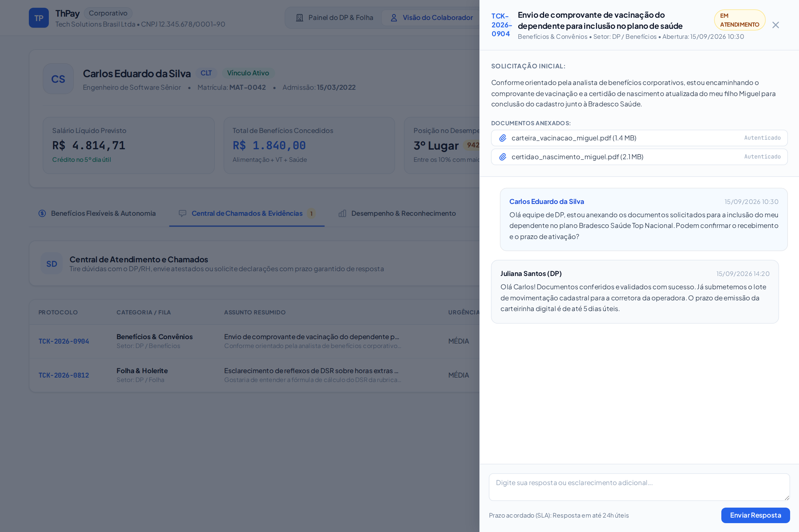
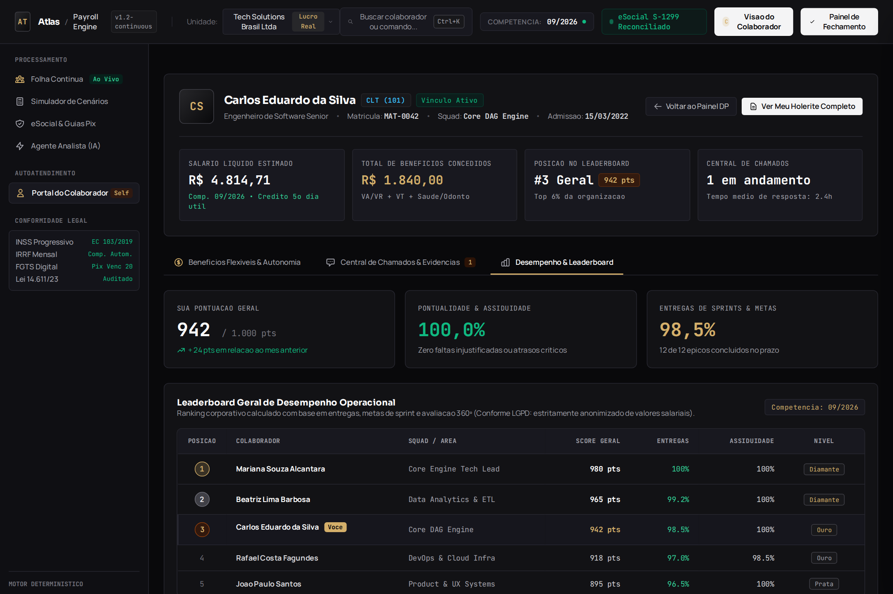
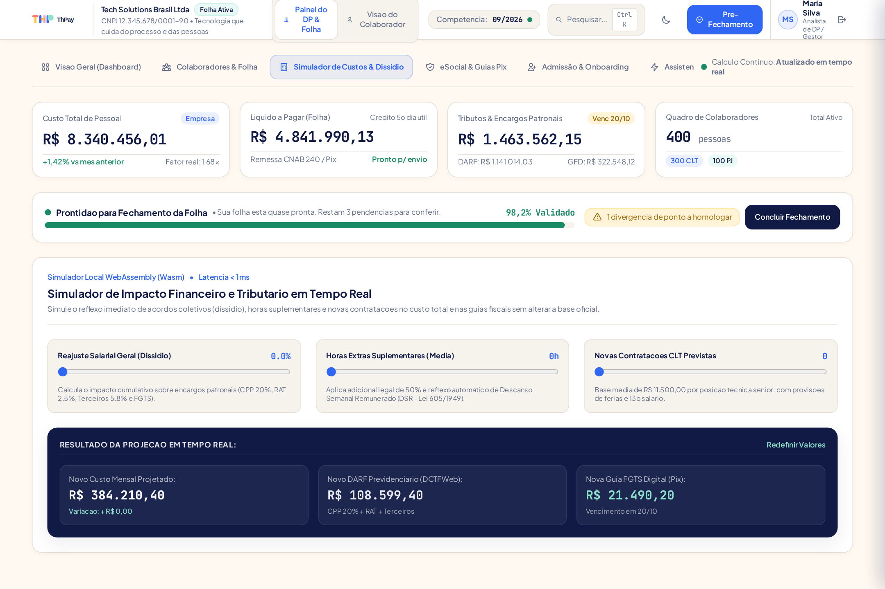
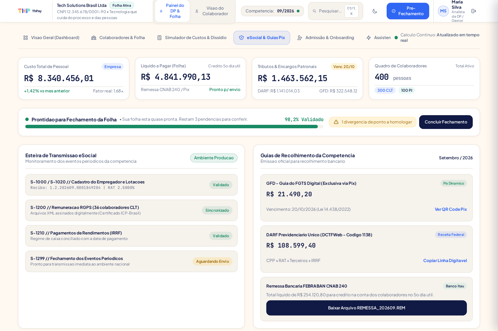
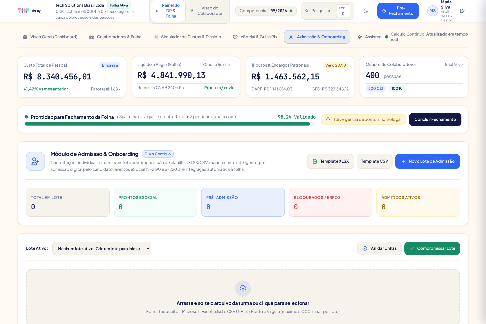

# ThPay // Motor de Folha de Pagamento e Conformidade Trabalhista

> Plataforma corporativa brasileira de processamento de folha de pagamento contínua (Continuous Payroll), conformidade trabalhista, previdenciária e fiscal (CLT, eSocial, DCTFWeb, FGTS Digital) e portal unificado de autoatendimento do colaborador com benefícios flexíveis e service desk.

---

## 1. Visao Geral e Proposta de Valor

O **ThPay** é uma infraestrutura de cálculo e conformidade trabalhista projetada para resolver a complexidade estrutural da folha de pagamento no Brasil. O sistema substitui o modelo tradicional de processamento em lote tardio (fechamento em dias críticos) pelo paradigma de **Continuous Payroll (Folha Contínua)**, onde cada lançamento, ajuste de benefício, hora extra ou alteração cadastral recalcula o grafo de remuneração em tempo real.

O ecossistema atende tanto à equipe de Departamento Pessoal (DP) e Recursos Humanos quanto ao colaborador final, integrando uma arquitetura poliglota especializada orientada a precisão financeira estrita e determinismo centavo a centavo.

### 1.1 Pilares Arquiteturais

1. **Calculo e Conformidade eSocial:** Desenvolvido em **Java 21 (LTS)** utilizando Virtual Threads (Project Loom), tipos de dados `BigDecimal` nativos para mitigação de erros de ponto flutuante e suporte a assinaturas digitais A1/A3 via `XMLDSig`.
2. **Interface do DP e Portal do Colaborador:** Construído em **TypeScript e Next.js 15** (com Tailwind CSS), oferecendo um design system de alta densidade de dados com navegação fluida em abas e gavetas contextuais (slide-in drawers).
3. **Simulador Instantaneo no Cliente:** Compilado em **Rust para WebAssembly (Wasm)**, permitindo que operadores e colaboradores executem projeções rescisórias, aumentos e simulações de férias no navegador com latência inferior a 1 milissegundo.
4. **Auditoria e Inteligencia Salarial:** Implementado em **Python 3.12+** com motor analítico **Polars**, gerando automaticamente os relatórios de transparência salarial exigidos pela Lei 14.611/2023 e trilhas de auditoria para prevenção de passivos trabalhistas.

---

## 2. Diagrama da Arquitetura do Sistema

```
+-----------------------------------------------------------------------------------------+
|                    PORTAL WEB UNIFICADO (TypeScript / Next.js 15 / Tailwind)            |
|  +---------------------------+  +---------------------------------+  +---------------+  |
|  | Dashboard Folha Continua  |  | Portal do Colaborador           |  | Service Desk  |  |
|  | - Readiness Bar (98.4%)   |  | - Flex Benefits (Split VA/VR)   |  | - Chamados DP |  |
|  | - Diretorio CLT + PJ      |  | - Opt-out de Vale-Transporte    |  | - SLA & Prazos|  |
|  | - Raio-X Holerite Drawer  |  | - Adesao Saude / Odonto         |  | - Anexos SHA  |  |
|  +---------------------------+  +---------------------------------+  +---------------+  |
+--------------------------------------------+--------------------------------------------+
                                             |
                      +----------------------+----------------------+
                      | (REST / OpenAPI / gRPC)                     | (Execucao Local Wasm)
                      v                                             v
+--------------------------------------------+  +-----------------------------------------+
|   CORE ENGINE & ESOCIAL (Java 21 LTS)      |  |  SIMULADOR DE BORDA (Rust / Wasm)       |
| - Motor DAG com ordenacao topologica       |  | - Pre-visualizacao de ferias/rescisao   |
| - BigDecimal nativo centavo a centavo      |  | - Calculo instantaneo sem rede (< 1ms)  |
| - Virtual Threads (Loom) para 50k+ vidas   |  | - Simulador de horas extras e reajustes |
| - Assinatura XMLDSig A1/A3 (JCA/JCE)       |  +-----------------------------------------+
| - Mensageria eSocial S-1200 / S-1210/1299  |
| - Integracao Pix FGTS Digital (GFD)        |
+---------------------+----------------------+
                      |
        (Eventos e Fechamentos Consolidados)
                      v
+-----------------------------------------------------------------------------------------+
|               ANALYTICS, COMPLIANCE & MIGRACAO (Python 3.12 / Polars)                   |
|   Relatorio Lei 14.611 (Equidade Salarial) | Deteccao de Anomalias | Ingestao Legada    |
+-----------------------------------------------------------------------------------------+
```

---

## 3. Galeria Operacional e Guia Visual do Sistema

Abaixo estao detalhados os modulos operacionais do ThPay com registros visuais de alta resolucao capturados diretamente da interface operacional da plataforma.

### 3.1 Tela de Autenticação Corporativa & Seleção de Perfil (Login RBAC)

Acesso seguro corporativo com validação de credenciais via hash salted SHA-256 e sessões persistentes com tokens de 256 bits no banco relacional. O sistema utiliza RBAC (*Role-Based Access Control*) com 12 perfis e realiza o direcionamento automático: analistas de DP e operadores acessam diretamente o Dashboard Geral da Folha, enquanto colaboradores acessam exclusivamente o Portal Self-Service.



**Recursos de Autenticação & Controle de Acesso:**
- **Redirecionamento Inteligente por Perfil:** Analistas de folha (`DP_GESTOR`, `DP_OPERADOR`, `RH_OPERADOR`, `EMPRESA_ADMIN`) caem automaticamente no Dashboard Geral da Folha; colaboradores (`COLABORADOR_SELF_SERVICE`) têm acesso restrito apenas ao seu portal individual.
- **Sessões Persistentes e Revogáveis:** Tokens opacos armazenados no servidor com expiração configurável e encerramento imediato de sessão no logout.
- **Seleção Rápida de Perfis para Avaliação:** Botões de acesso em 1 clique para demonstração com os perfis de Analista de DP (Maria Silva) e Colaborador CLT (Ana Souza).
- **Conformidade de Segurança:** Alinhamento com a LGPD e registro automático de todos os eventos de acesso no log imutável de auditoria.

---

### 3.2 Tela Inicial Pós-Login do Analista: Dashboard Executivo Consolidado com Gráficos & Acessos Rápidos

A tela inicial apresentada ao analista de folha logo após a autenticação corporativa é um painel executivo 100% consolidado, sem exposição de listagens nominais de colaboradores na visão principal. O analista visualiza indicadores estratégicos de prontidão, gráficos analíticos de custos e botões de navegação rápida para os módulos operacionais e itens recentes.



**Estrutura e Recursos do Dashboard Consolidado:**
- **Métricas Executivas de Topo:** Custo Total de Pessoal (R$ 8.340.456,01 com fator real 1.68x sobre o base), Líquido a Pagar da Folha (R$ 4.841.990,13 pronto para remessa bancária CNAB 240 / Pix), Tributos & Encargos Patronais (R$ 1.463.562,15 com vencimento em 20/10; DARF R$ 1.141.014,03 e GFD FGTS Digital Pix R$ 322.548,12) e Quadro Total de Colaboradores (400 pessoas ativas, sendo 300 CLT e 100 PJ).
- **Barra de Prontidão da Folha (Readiness Bar):** Diagnóstico contínuo do fechamento da competência (98,2% validado), alerta visual de pendências a homologar (1 divergência de ponto eletrônico pendente) e ação direta para conclusão do fechamento.
- **Gráfico de Evolução Mensal do Custo de Pessoal:** Histórico consolidado dos últimos 6 meses (Abr 7.450k a Set 8.340k/2026) com valores discriminados em milhares de reais, taxa de variação (+11,9% vs Abr) e cálculo da média semestral (R$ 7.921.600,00).
- **Gráfico de Composição das Despesas de Pessoal:** Barra de segmentação proporcional e cartões analíticos dividindo os custos em Salários Líquidos (58,1% - R$ 4.841.990,13), Tributos & Encargos Patronais (17,5% - R$ 1.463.562,15) e Benefícios & Provisões (24,4% - R$ 2.034.903,73).
- **Gráficos de Regime Contratual & Alocação por Centros de Custo:** Proporção contratual CLT (75% - 300 pessoas, custo médio R$ 22.450/mês) vs PJ (25% - 100 pessoas, custo médio R$ 18.250/mês), e decomposição orçamentária realista por departamento alinhada a empresas SaaS/Tech (Tecnologia & Engenharia 41,4% - R$ 3.456.187,01; Produto & Design 13,7% - R$ 1.146.079,60; Comercial & Vendas 11,3% - R$ 944.012,94; Operações & Atendimento 9,9% - R$ 828.827,01; Outros 23,7% - R$ 1.965.349,45).
- **Grade de Acesso Rápido às Operações e Itens Recentes:** 6 atalhos diretos para os módulos operacionais:
  1. *Diretório de Colaboradores (400 Ativos):* Acesso à listagem completa com paginação dinâmica (25, 50, 100 ou Todos), busca instantânea por nome, cargo, CPF e setor, filtros contratuais CLT/PJ, exportação CSV e gaveta lateral de Raio-X.
  2. *Admissões & Onboarding em Massa:* Gestão do último lote processado com 50 pessoas, validação OCR de documentos e geração de eventos S-2200.
  3. *eSocial & Guias Pix (DARF / FGTS):* Transmissão de eventos periódicos e emissão do QR Code Pix da guia GFD.
  4. *Central de Chamados do Service Desk:* Acompanhamento das solicitações de colaboradores com SLA e timeline.
  5. *Simulador de Custos & Dissídio:* Modelagem preditiva de reajustes sindicais e contratações em Rust/Wasm.
  6. *Assistente IA de Auditoria:* Diagnóstico de conformidade e conferência automatizada de rubricas.

---

### 3.3 Raio-X do Holerite (Live Payslip Inspector Lateral)

Ao clicar sobre qualquer colaborador no diretório, o sistema abre uma gaveta lateral deslizante (*slide-in drawer*) que apresenta a anatomia completa do cálculo sem que o analista perca o contexto da lista geral.



**Detalhamento Técnico das Rubricas:**
- **Fatiamento Marginal do INSS (Emenda Constitucional 103/2019):** Decomposição auditável por faixas progressivas (7.5%, 9%, 12% e 14%) com demonstração exata da alíquota efetiva.
- **Comparador Tributário de IRRF:** Análise algorítmica em tempo real comparando as deduções legais tradicionais (dependentes, pensão, previdência oficial) contra o Desconto Simplificado Mensal (Art. 67-E da Lei 14.663/2023), aplicando automaticamente o método financeiramente mais vantajoso ao trabalhador.
- **Custo Total Empresa (True Employer Cost):** Apuração transparente do multiplicador real do colaborador (1.68x sobre o salário base), discriminando INSS Patronal (20%), RAT ajustado por FAP e contribuições a Terceiros (Sistema S).

---

### 3.4 Portal do Colaborador & Gestão Autônoma de Benefícios Flexíveis

Ambiente individual e centralizado no qual o colaborador acessa suas informações contratuais, holerite digital e exerce autonomia na personalização de seus benefícios corporativos, operando estritamente dentro das regras de negócio e limites orçamentários definidos pela organização.



**Mecanismos de Autonomia Regrada:**
- **Split Alimentação / Refeição (VA/VR):** Slider de ajuste proporcional com granularidade de 5% (ex.: 70% Vale-Alimentação e 30% Vale-Refeição), preservando o saldo total mensal de R$ 1.400,00 e garantindo conformidade com a Lei 14.442/2022 (PAT) contra desvio de finalidade.
- **Gestão de Vale-Transporte (Opt-Out):** Possibilidade de solicitar o cancelamento ou adesão ao VT mediante declaração formal no sistema (Decreto 10.854/2021), eliminando automaticamente o desconto de até 6% sobre o salário básico na competência seguinte.
- **Adesão a Planos de Saúde e Odontológico:** Controle de inclusão e desfiliação de planos com exibição transparente dos valores de coparticipação, carências e regras de custeio patronal.
- **Linha do Tempo de Solicitações:** Histórico auditável de todas as opções exercidas pelo trabalhador com carimbo de data, hora e competência de vigência.

---

### 3.5 Central de Chamados do Colaborador (Service Desk Integrado ao DP)

Canal formal e estruturado para que o colaborador registre dúvidas, solicitações de ajuste cadastral, requerimentos de férias, contestações de ponto ou pedidos de declarações oficiais junto à equipe de Departamento Pessoal.



**Recursos de Gestão de Demandas:**
- **Filas Departamentais Categorizadas:** Direcionamento inteligente entre equipes de Benefícios, Folha de Pagamento, Ponto Eletrônico e Férias.
- **Acordo de Nível de Serviço (SLA):** Rastreamento de tempo de primeira resposta e tempo de resolução por prioridade (Crítica, Alta, Média, Baixa).
- **Indicadores de Status:** Visibilidade em tempo real se o chamado está Em Análise, Aberto, Aguardando Documento ou Concluído.

---

### 3.6 Detalhes do Chamado & Linha do Tempo com Anexos de Evidência

Ao selecionar um chamado, a plataforma expande uma gaveta com o histórico cronológico de interações, permitindo troca de mensagens bidirecionais entre o colaborador e o analista de DP responsável.



**Segurança e Trilha de Auditoria:**
- **Histórico Imutável:** Linha do tempo encadeada com registro de autoria de cada mensagem.
- **Anexo de Evidências com Hash Criptográfico:** Armazenamento de arquivos anexados (ex.: comprovantes de residência, atestados médicos, certidões) com identificador hash SHA-256 para comprovação de autenticidade jurídica.
- **Caixa de Diálogo Interativa:** Interface para envio de contra-respostas e anexação de novos documentos sem necessidade de troca de e-mails paralelos.

---

### 3.7 Leaderboard Operacional & Gamificação com Privacidade LGPD

Módulo de acompanhamento de desempenho individual e de equipes baseado em métricas puramente operacionais, incentivando o engajamento e a pontualidade sem expor informações remuneratórias.



**Conformidade com a LGPD (Lei 13.709/2018):**
- **Isolamento Salarial:** O ranking operacional baseia-se exclusivamente em métricas de produtividade (entregas de sprint, pontualidade de registro de ponto, treinamentos concluídos).
- **Proteção da Privacidade:** Nenhuma faixa de renda, remuneração fixa, variável ou dado financeiro individual é exposto aos pares, cumprindo rigorosamente os princípios de minimização e proteção de dados sensíveis.

---

### 3.8 Simulador de Borda em Tempo Real (Rust / Wasm)

Ferramenta interativa de cálculo preditivo executada localmente no navegador do usuário. Permite prever impactos tributários e financeiros antes da efetivação de contratações, demissões ou promoções.



**Módulos de Simulação:**
- **Simulador de Rescisão:** Cálculo instantâneo das verbas rescisórias conforme a modalidade de desligamento (Demissão sem justa causa, Pedido de demissão, Acordo Mútuo do Art. 484-A da CLT).
- **Impacto de Horas Extras e Adicionais:** Projeção de reflexos em DSR (Descanso Semanal Remunerado), FGTS, férias e 13º salário.
- **Execução Desconectada:** Resposta em sub-milissegundos via WebAssembly, sem consumo de recursos do cluster de processamento principal.

---

### 3.9 Central eSocial & Guias Unificadas Pix (FGTS Digital)

Central de transmissão e monitoramento dos lotes de eventos enviados ao ambiente nacional do eSocial, DCTFWeb e emissão das guias rescisórias e mensais do FGTS Digital via Pix.



**Capacidades de Integração Governamental:**
- **Monitor de Eventos Periódicos:** Geração e transmissão de eventos S-1200 (Remuneração), S-1210 (Pagamentos) e S-1299 (Fechamento).
- **Guia do FGTS Digital (GFD) com Pix Dinâmico:** Geração de QR Code Pix imediato para recolhimento bancário instantâneo, dispensando a emissão de guias GRF/GRRF legadas em código de barras.
- **Validação Prévia de Schemas XSD:** Verificação estrutural local antes do envio para mitigar rejeições e notificações fiscais pelo Serpro/Receita Federal.

---

### 3.10 Módulo de Admissão em Lote, Onboarding & eSocial (S-2190 / S-2200)

Interface de importação e validação de admissões individuais e em lote, com suporte a planilhas XLSX multiabas e CSV, mapeamento semântico de colunas com sinônimos em português, validação linha a linha e correção de erros diretamente no sistema antes da efetivação.



**Recursos de Admissão, Onboarding e eSocial:**
- **Importação Inteligente de Planilhas:** Suporte completo a planilhas XLSX e CSV com detecção de encoding e separadores; mapeamento semântico automático de cabeçalhos baseado em dicionários de equivalência.
- **Validação Antecipada e Edição em Linha:** Conferência estrita de CPF (algoritmo Módulo 11), duplicidades no lote e no banco de dados, piso salarial mínimo, regras de maioridade/idade legal e edição direta de células rejeitadas na interface sem necessidade de reupload.
- **Portal de Pré-Admissão do Candidato:** Geração de links de autoatendimento com token temporário seguro de 7 dias para conferência de dados, cadastro de dependentes, contas bancárias e upload de documentos com hash SHA-256 real.
- **Camada eSocial Desacoplada (v1.3):** Emissão de eventos preliminares S-2190 e eventos de admissão completa S-2200 em XML e JSON, com gravação de protocolo e recibo de entrega auditáveis.
- **Automação Pós-Admissão:** Criação imediata do contrato de trabalho no banco de dados persistente, provisionamento de credenciais de autoatendimento, vinculação a benefícios e geração das trilhas de onboarding do colaborador.

---

## 4. Matriz Normativa e Conformidade Legal

| Marco Legal | Aplicação no Sistema ThPay | Implementação Técnica |
|---|---|---|
| **CLT (Decreto-Lei 5.452/1943)** | Regras gerais de proventos, descontos, DSR, adicional noturno, férias e 13º salário. | Nó de cálculo no motor DAG com precedência de rubricas e proteção anti-negativo. |
| **Emenda Constitucional 103/2019** | Tabelas progressivas de contribuição previdenciária (INSS) com alíquotas marginais (7.5% a 14%). | Algoritmo de fatiamento de faixas com cálculo de alíquota efetiva auditável. |
| **Lei 14.663/2023 & IN RFB 2141** | Comparador automático entre Dedução Legal e Desconto Simplificado Mensal de IRPF (R$ 564,80). | Módulo `thpay.tax.irrf` que avalia as duas vias e seleciona a de menor impacto fiscal. |
| **Lei 14.442/2022 & Decreto 10.854/2021** | Regulamentação do Programa de Alimentação do Trabalhador (PAT) e flexibilização VA/VR. | Trava de integridade de saldo total e validação de proporção cadastrada pelo colaborador. |
| **Lei 7.418/1985 & Decreto 10.854/2021** | Concessão do Vale-Transporte e limite de desconto de 6% sobre o salário básico. | Opt-out formal com termo de declaração e suspensão imediata da retenção em folha. |
| **Lei 14.611/2023** | Transparência e Igualdade Salarial entre Mulheres e Homens em funções equivalentes. | Pipeline em Python/Polars para cálculo do desvio-padrão salarial por CBO e gênero. |
| **Lei 13.709/2018 (LGPD)** | Proteção de dados pessoais e sensíveis de colaboradores e prestadores. | Segregação estrita de privilégios e isolamento total de salários no ranking de desempenho. |
| **FGTS Digital & DCTFWeb** | Recolhimento exclusivo via arranjo de pagamentos Pix instantâneo do Banco Central. | Emissor de payload Pix Copia e Cola e QR Code dinâmico com identificador TXID único. |

---

## 5. Estrutura de Arquivos do Repositorio

```
ThPay/
├── README.md                      # Documentacao executiva e guia visual com capturas de tela
├── PROXIMOS_PASSOS.md             # Backlog mestre e registro de evolucao da arquitetura
├── SPECIFICATION.md               # Mapeamento matematico e normativo exaustivo de regras
├── pyproject.toml                 # Metadados e dependencias do projeto Python
├── capture_screenshots.js         # Script de automacao para captura em lote de telas (Puppeteer/Chromium)
├── demo.py                        # Script de demonstracao executavel no terminal
├── docs/                          # Especificacoes detalhadas de produto e engenharia
│   ├── TAKO_PARADIGM_UI_UX.md     # Paradigma de produto estilo Tako e arquitetura de interfaces
│   ├── PORTAL_COLABORADOR_E_BENEFICIOS_FLEXIVEIS.md # Engenharia do Self-Service e Service Desk
│   └── screenshots/               # Galeria de registros visuais em alta definicao
│       ├── 00_login_autenticacao.png
│       ├── 01_dashboard_folha_continua.png
│       ├── 02_raio_x_holerite_drawer.png
│       ├── 03_portal_colaborador_beneficios.png
│       ├── 04_central_chamados_service_desk.png
│       ├── 05_chamado_detalhes_timeline.png
│       ├── 06_leaderboard_desempenho.png
│       ├── 07_simulador_cenarios.png
│       ├── 08_esocial_guias_pix.png
│       └── 09_admissoes_lotes_onboarding.png
├── ui/                            # Prototipo SPA interativo de alta fidelidade
│   ├── index.html                 # Interface completa com Dashboard, Admissoes, Portal, Chamados e Guias Pix
│   └── dataset_400.js             # Base oficial de 400 colaboradores reais e rubricas de mercado Robert Half
├── thpay/                         # Motor de calculo funcional e aplicacao em Python
│   ├── db/                        # Banco relacional, schema DDL, conexao e migracoes versionadas
│   ├── api/                       # API REST, autenticacao salted SHA-256, RBAC e auditoria
│   ├── audit/                     # Logger de auditoria imutavel e append-only
│   ├── storage/                   # Gerenciamento de arquivos e calculo de hash SHA-256 real
│   ├── domain/                    # Modelos de dominio (Empresa, Contrato, Rubrica, Repositorios)
│   ├── admission/                 # Motor de admissao em lote, parser CSV/XLSX, validacao e templates
│   ├── esocial/                   # Camada eSocial desacoplada (v1.3: S-2190 e S-2200)
│   ├── engine/                    # Resolucao de dependencias em Grafo Aciclico Dirigido (DAG)
│   ├── tax/                       # Algoritmos fiscais (INSS progressivo, IRRF comparado, FGTS)
│   └── pipelines/                 # Pipeline da folha mensal com protecao contra saldo negativo
└── tests/                         # Suite de testes automatizados e regressao matematica
    ├── test_inss.py               # Testes de faixas e aliquotas progressivas de INSS
    ├── test_irrf.py               # Testes de deducoes legais e desconto simplificado IRRF
    ├── test_engine.py             # Testes de ordenacao topologica e DAG de calculo
    ├── test_portal_beneficios.py  # Testes de flexibilizacao de beneficios e chamados
    ├── test_db_migrations.py      # Testes de migracoes e integridade referencial do banco
    ├── test_auth_rbac.py          # Testes de autenticacao, sessoes e RBAC granular
    ├── test_admission_engine.py   # Testes unitarios do motor de admissao e validadores
    ├── test_esocial_admission.py  # Testes de geracao dos eventos eSocial S-2190 e S-2200
    ├── test_admission_batch_50.py # Teste de integracao ponta a ponta do lote de 50 admissoes
    └── test_api_server.py         # Testes de integracao dos endpoints HTTP da API
```

---

## 6. Como Executar e Validar

### 6.1 Iniciar a API de Aplicacao ThPay
Para iniciar o servidor HTTP da API com banco relacional SQLite/PostgreSQL e rotas REST:
```bash
python3 -m thpay.api.server
```
A API sera iniciada em `http://localhost:8000` com endpoints `/api/health`, `/api/v1/auth/*`, `/api/v1/employees`, `/api/v1/admission-batches/*` e `/api/v1/payroll/*`.

### 6.2 Executar a Interface Interativa no Navegador
Abra o arquivo `ui/index.html` em qualquer navegador moderno ou inicie um servidor HTTP local:
```bash
python3 -m http.server 3000 --directory ui
```
Em seguida, acesse:
```
http://localhost:3000
```

### 6.3 Executar a Demonstracao no Terminal
Para rodar a simulação do pipeline de cálculo com geração de holerites e auditoria de alíquotas marginais:
```bash
python3 demo.py
```

### 6.4 Executar a Suite Completa de Testes Automatizados
Para verificar a integridade dos cálculos matemáticos de INSS, IRRF, motor DAG, banco de dados, autenticação, admissão em lote e eSocial:
```bash
python3 -m unittest discover tests/
```

### 6.5 Recapturar os Screenshots do Sistema
O pipeline de captura automatizada pode ser reexecutado a qualquer momento utilizando o script Node.js configurado com Puppeteer e Chromium headless:
```bash
node capture_screenshots.js
```

---

*ThPay Core Team // Arquitetura Sagital de Sistemas Críticos*
